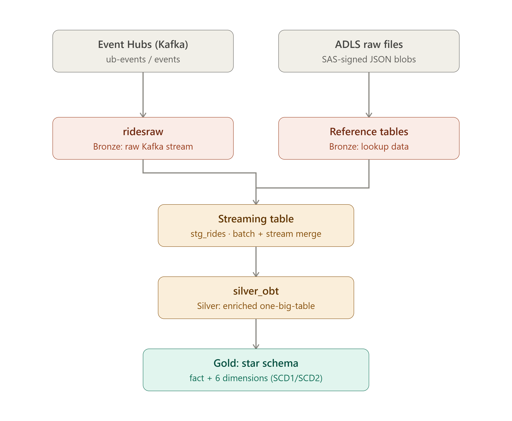

# Uber_Data_Engineering_Project
## 📋 Introduction
- This project builds a real-time + batch data pipeline on Azure for a simulated Uber-style ride platform, streaming live ride events through Event Hubs and Kafka into Databricks while batch-loading reference and historical data from ADLS. Azure Databricks Lakeflow Declarative Pipelines then transform and merge both sources into a Kimball-style star schema (dimensions + fact, with SCD Type 1/2 history) ready for analytics.
## 📁Project Architecture
 

 ## 📁Project Structure
```
ub-project/
├── manifest.mf                                    # Databricks export manifest
├── bronze_adls.py                                 # Bronze: loads reference tables (SAS URL) + 
│                                                   #   parses raw Kafka rides (ridesraw -> parsed)
└── ub_rides_ingest/
    ├── explorations/
    │   └── sample_exp.py                          # Scratch/dev copy of the Kafka ingestion logic
    └── transformations/
        ├── ingest.py                              # Bronze: Kafka/Event Hubs streaming source (ridesraw)
        ├── silver.py                               # Silver: stg_rides streaming table
        ├── silver_obt.sql                          # Silver: enriched one-big-table (joins to reference data)
        └── model.py                                # Gold: star schema (dimensions + fact, SCD1/SCD2)
```
## 🤹 Technologies Used

**Cloud Platform**
- Microsoft Azure

**Ingestion**
- Azure Event Hubs (real-time ride event streaming)
- Kafka protocol (SASL_SSL, consumed via Spark Structured Streaming)
- Azure Data Lake Storage Gen2 (ADLS) — reference/historical data landing zone

**Processing & Transformation**
- Azure Databricks — Lakeflow Declarative Pipelines (Delta Live Tables)
- Apache Spark Structured Streaming
- PySpark
- Spark SQL

**Storage & Governance**
- Delta Lake
- Unity Catalog (three-level namespace: `ub_cata.bronze.*`)

**Language & Libraries**
- Python
- pandas

**Data Modeling**
- Kimball-style dimensional modeling (star schema)
- Slowly Changing Dimensions — SCD Type 1 & SCD Type 2

## 💻 Setup & Getting Started

**Prerequisites**
- An Azure subscription with an Event Hubs namespace and ADLS Gen2 storage account
- A Databricks workspace with Unity Catalog enabled
- A Unity Catalog catalog/schema created for this project (`ub_cata.bronze`)

**Steps**
1. Create an Event Hub (e.g. `events`) inside your Event Hubs namespace and note its connection string.
2. Store the connection string in a **Databricks secret scope** — never hardcode it in notebook source:
```bash
   databricks secrets create-scope ub-project
   databricks secrets put-secret ub-project eventhub-conn-str
```
3. Update `ingest.py` to read the secret instead of a literal string:
```python
   EH_CONN_STR = dbutils.secrets.get(scope="ub-project", key="eventhub-conn-str")
```
4. Upload reference/lookup JSON files to ADLS and generate a short-lived SAS URL (or better, use a Unity Catalog external location/credential instead of SAS URLs).
5. Deploy `ub_rides_ingest/transformations/` as a Lakeflow Declarative Pipeline in Databricks, pointing it at the `ub_cata.bronze` schema.
6. Run the pipeline to populate Bronze → Silver → Gold tables.

## 🎯 Project Outcomes

- A unified streaming Silver table (`stg_rides`) merging historical bulk rides and live streamed ride events into one consistent schema.
- An enriched one-big-table (`silver_obt`) resolving every foreign key into human-readable attributes via streaming joins with a watermark.
- A production-style Kimball star schema in Gold, with full SCD Type 2 history on location.
- A pipeline architecture supporting both batch backfill and real-time ingestion through the same downstream Silver/Gold model.

## 🔧 Troubleshooting

**`CBS Token authentication failed` when sending/consuming Event Hub messages**
- Usually an `EntityPath` mismatch between the connection string and the `eventhub_name`/`EH_NAME` passed to the client — they must refer to the same entity, not the namespace.

**`'NoneType' object has no attribute 'strip'` when creating the producer/consumer client**
- The connection string environment variable isn't loading — check `.env` formatting (no quotes, no spaces around `=`) and that the script runs from the correct working directory.

**`getaddrinfo failed` / `ErrorCondition.SocketError`**
- DNS couldn't resolve the Event Hub namespace hostname — check for typos in the `Endpoint=sb://...` value.

**Kafka bootstrap / node-assignment timeouts on Databricks serverless compute**
- Serverless compute enforces Network Connectivity Config (NCC) egress rules. Ensure an NCC rule allows outbound traffic to the Event Hubs namespace on port `9093`.
  

